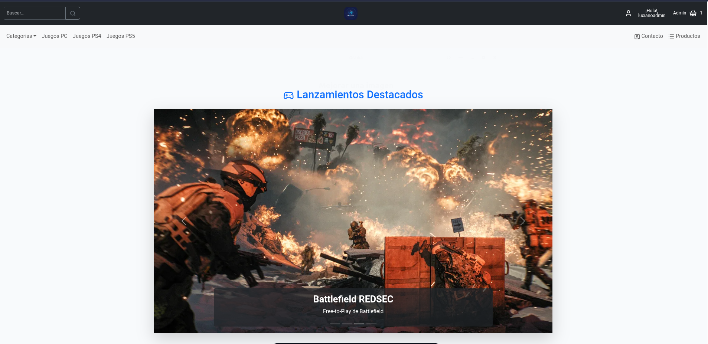
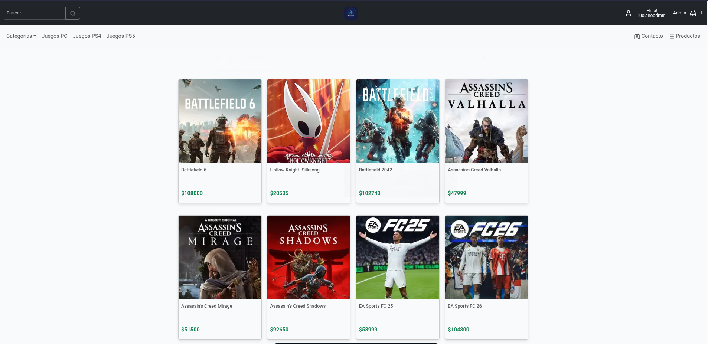

# 🏷️ E-Commerce de juegos - Proyecto Final

## 📌 Introducción / Descripción general

* “Este proyecto es una aplicación web desarrollada como trabajo final del curso de React JS - BA Aprende, que simula una tienda de videojuegos con funcionalidades reales de e-commerce.”
* “Permite navegar productos, filtrar por categorías, añadir al carrito y completar una compra mediante un formulario validado.”

---

### ✨ **Características Principales**

* 🛒 Carrito de compras funcional
* 🎮 Catálogo de juegos con categorías/plataformas
* 🔍 Detalle de cada producto
* 📥 Formularios con validaciones personalizadas
* 🚀 Consumo de API (MockAPI)
* 💾 Persistencia en LocalStorage (carrito, usuario, etc.)
* 🔐 Autenticación de usuarios (con ruta protegida)
* 📧 Envío de newsletter usando EmailJS
* 📱 Diseño responsive con React-Bootstrap / Lucide-React

---

### 🧩 Tecnologías Utilizadas

* React JS
* React Router Dom v7
* Bootstrap / React-Bootstrap
* React Hot Toast
* EmailJS
* Lucide Icons
* Context API / Custom Hooks

---

### 🖼️ Capturas de pantalla

---

### 🚀 Deploy

**Vercel**

* Repositorio | [https://github.com/LucianoPesqueira/techba-reactjs-proyecto-final](https://github.com/LucianoPesqueira/techba-reactjs-proyecto-final)
* Deploy |
